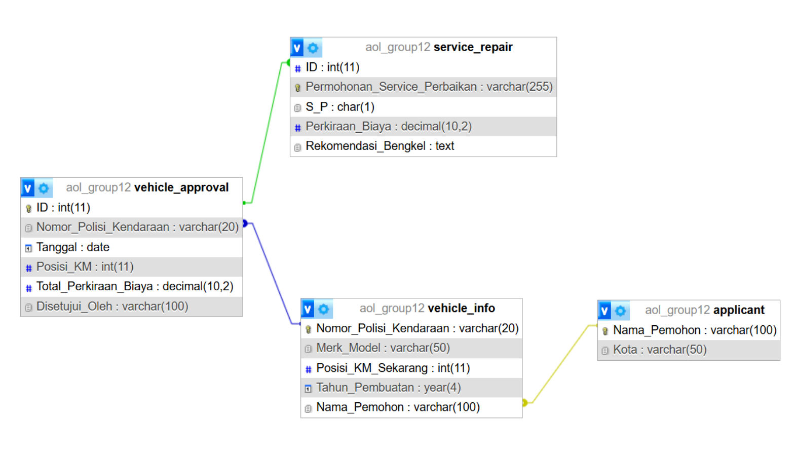
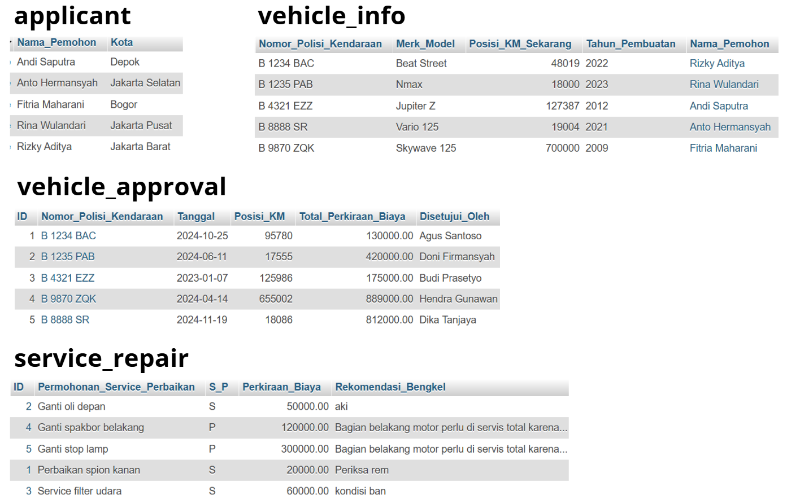

# 🚲 Motorcycle Repair & Maintenance Database  

## 📌 Project Overview  
This database is designed to manage **motorcycle service and repair records**, ensuring efficient tracking of maintenance requests, vehicle details, and approval processes. Built with **MySQL in XAMPP**, the schema follows **Crow’s Foot notation** for clear entity relationships.  

## 📂 Dataset Summary  
- **Dataset Name**: Vehicle Service and Maintenance Records  
- **Number of Records**: 40 entries  
- **Number of Attributes**: 15 columns  
- **Key Features**:  
  - **Vehicle Info**: License Plate (`Nomor Polisi Kendaraan`), Brand/Model (`Merk/Model`), Manufacturing Year (`Tahun Pembuatan`), Current Mileage (`Posisi KM Sekarang`).  
  - **Service Details**: Repair Request (`Permohonan Service/Perbaikan`), Recommended Workshop (`Rekomendasi Bengkel`), Estimated Cost (`Perkiraan Biaya`).  
  - **Approval Info**: Approved By (`Disetujui Oleh`), Applicant (`Pemohon`).  

## 🔍 Data Quality & Potential Issues  
- **Redundant and Transitive Fields**  
- **Normalization Issues** (Insertion, Deletion, and Update anomalies)  
  - **Insertion Anomaly**: If a request is pending approval, `Disetujui Oleh` and `Rekomendasi Bengkel` remain empty.  
  - **Deletion Anomaly**: Deleting a record with only one entry removes related data.  
  - **Update Anomaly**: If an applicant (`Pemohon`) moves, all records with `Kota` must be updated individually.  

## 🔗 Key Relationships  
- **`service_repair`**: Tracks service and repair requests, including recommendations.  
- **`vehicle_info`**: Stores details about motorcycles, such as mileage and ownership.  
- **`applicant`**: Manages applicant data, linked through the owner (`Nama_Pemohon`).  
- **`vehicle_approval`**: Logs repair approvals, connecting vehicle records and estimated costs.  

## 📊 Normalized Design  
- Each table represents a **single entity** for easier updates and better data consistency.  
- **Foreign key (FK) constraints** ensure data integrity (e.g., linking `vehicle_info` to `applicant`).  

## 🚀 Scalability  
- Designed for future expansion, such as adding new service types, vehicle categories, or applicants.  

## 📸 ERD & Tables  
  
  

## 📂 Files Included  
📁 **Project Files**  
- [`dataschema.sql`](dataschema.sql) – INSERT and ALTER TABLE  
- [`erd.png`](erd.png) – Entity-Relationship Diagram  
- [`motorcycle_Un_NF3.xlsx`](motorcycle_Un_NF3.xlsx) – Unnormalized data, NF1 until NF3
- [`tables.png`](tables.png) – Table structure visualization  

## 🛠️ Setup Instructions  
1. **Install XAMPP** and start the **MySQL** module.  
2. Open **phpMyAdmin** and create a new database.  
3. Import [`dataschema.sql`](dataschema.sql) to set up the database.  
4. Verify the tables and relationships using the ERD.  

## 📌 License  
This project is for educational purposes. Feel free to use and modify it.  

---
